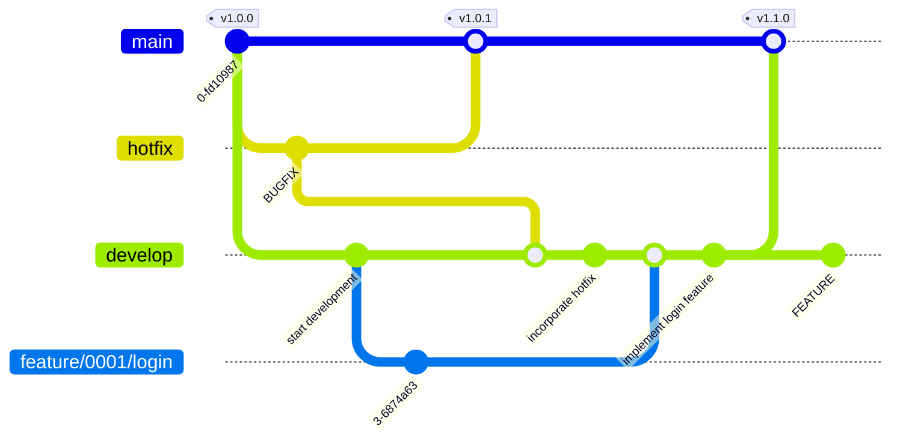

# Branch Strategy

- We adopt a branching strategy based on Git Flow.
- `develop` is used as the integration branch, but we also make use of per-Issue integration branches according to the scale of the Issue and the realities of release operations.



## 1. Branch Types

### Basic Syntax

```ini
<branch-type>/<issue-number>/<task-description>
```

Some branches, such as hotfix branches, do not include an Issue number. In those cases:

```ini
hotfix/<task-description>
```

### Naming Conventions

| Branch Type           | Naming Convention                   | Purpose                                                                                                |
| --------------------- | ----------------------------------- | ------------------------------------------------------------------------------------------------------ |
| **Production**        | `main`                              | Stable, production-deployable code. Always kept in a released state.                                   |
| **Development**       | `develop`                           | Integration target for all features and fixes (the main development branch).                           |
| **Feature**           | `feature/<issue-number>/<task>`     | New feature development or improvement tasks. Small Issues are PR'd directly into develop.             |
| **Enhancement**       | `enhancement/<issue-number>/<task>` | Improvements to existing features, such as UX improvements or performance optimization.                |
| **Bug fix**           | `bugfix/<issue-number>/<task>`      | Branch for fixing defects. Integrated into develop after testing.                                      |
| **Issue integration** | `issue/<issue-number>/integration`  | Created **only for medium-to-large Issues**. Integration branch for combining multiple subtasks.       |
| **Hotfix**            | `hotfix/<issue-number>`             | Immediate fixes for production. Merged into both main and develop after the fix.                       |
| **Test/verification** | `test/<issue-number>/<task>`        | Temporary branch for test code or verification. Deleted after verification is complete.                |
| **Documentation**     | `docs/<issue-number>/<task>`        | Branch for updating documentation, guides, README, etc.                                                |
| **Refactoring**       | `refactor/<issue-number>/<task>`    | Branch for improving internal structure without changing behavior.                                     |
| **Sandbox/prototype** | `sandbox/<task>`                    | Experimental branch for trying new ideas or PoCs (unofficial). Not intended to be merged into stable.  |

### Naming Examples

| Branch Name                  | Use                                            |
| ---------------------------- | ---------------------------------------------- |
| `feature/0123/add-login`     | New feature                                    |
| `bugfix/0123/fix-login-error`| Fix                                            |
| `issue/0123/integration`     | Issue integration containing multiple subtasks |
| `hotfix/0145/critical-fix`   | Emergency response                             |

## 2. Development Flow

### Step 1. Subtask Development

For each Issue, create a branch for every subtask you need.

```bash
git switch develop
git switch -c feature/0123/add-login
git switch -c bugfix/0123/fix-login-error
```

- For small Issues, PR directly into develop as-is (go to Step 3).
- For medium-to-large Issues, create an Issue integration branch and combine the subtasks (go to Step 2).

### Step 2. Integration Branch for Medium-to-Large Issues (optional)

Create this only when you want to review multiple subtasks together.

```bash
git switch develop
git switch -c issue/0123
git merge feature/0123/add-login
git merge bugfix/0123/fix-login-error
git push -u origin issue/0123
```

- Create an integration PR: `issue/0123` → `develop`
- Review and test together as a team.

### Step 3. Integration into develop

- Create PRs into `develop` per Issue or per subtask.
- When merging locally, use `git merge --no-ff`.

### Step 4. Release

- Update the version tag in `project.yml` and create a PR into the `main` branch.
- Tagging and release-note creation are performed automatically when the PR is merged.

### Operational Notes

| Target                    | Branch Naming Convention                                          | Use / Scope                   | Operational Policy                     | Notes                                |
| ------------------------- | ----------------------------------------------------------------- | ----------------------------- | -------------------------------------- | ------------------------------------ |
| **Small Issue**           | `feature/<issue-number>-<task>`<br>`bugfix/<issue-number>-<task>` | Small new features or fixes   | PR directly into `develop`             | For single tasks and minor fixes     |
| **Medium-to-large Issue** | `issue/<issue-number>`                                            | Integrating multiple subtasks | Combine subtasks and PR into `develop` | Review `feature` / `bugfix` together |

## 3. Branch Deletion Policy

| Branch Type                    | Deletion Timing            | Notes                                                  |
| ------------------------------ | -------------------------- | ------------------------------------------------------ |
| `feature` / `bugfix` / `issue` | After merging into develop | Delete immediately (track history with tags if needed) |

## 4. Cautions

### Rule 1: Use lowercase and hyphens

- Always write branch names in lowercase.
- Uppercase letters can cause problems in environments where the file system is case-sensitive.
- Use hyphens (`-`) to separate words.

**📘 Example**

- ✅ Good: `feature/user-login`
- ❌ Avoid: `Feature_UserLogin`, `FeatUserLogin`

### Rule 2: Start branch names with a clear token

- Start each branch name with a category token that indicates its purpose.
- Example tokens:
  - `feature` (new feature development)
  - `bugfix` (bug fix)
  - `docs` (documentation update)
- Separate the token from the description with a slash (`/`).

**📘 Example**

- ✅ Example: `bugfix/payment-timeout`
- ❌ Avoid: `payment-timeout` (purpose unclear)

**Usage Examples**

```bash
# Listing branches by token
$ git branch --list "feature/*"

# Pushing or mapping branches with tokens
$ git push origin 'refs/heads/feature/*'

# Deleting multiple branches by token
$ git branch -D $(git branch --list "feature/*")
```

### Rule 3: Keep branch names concise and clear

- Avoid names that are too long, while still conveying intent.
- Overly long branch names do not fit on a single line in log output, reducing visibility.

**📘 Example**

- ✅ Good: `refactor/api-headers`
- ❌ Bad: `refactor/update-the-way-we-handle-request-headers-in-api`

### Rule 4: Do not create branches that may cause conflicts

- Avoid names with unclear intent, such as `git switch -c feature`, or names that may conflict with existing branches.
- Git internally manages branch names as paths (a directory structure), so if `feature` already exists, `feature/login-v2` cannot be created due to a name conflict.
  - This is because you cannot have a file and a directory with the same name at the same level.

**📘 Example**

```bash
$ git switch -c bugfix/0123/fix-login-error
Switched to a new branch 'bugfix/0123/fix-login-error'

$ ls .git/refs/heads/bugfix/0123
fix-login-error
```
